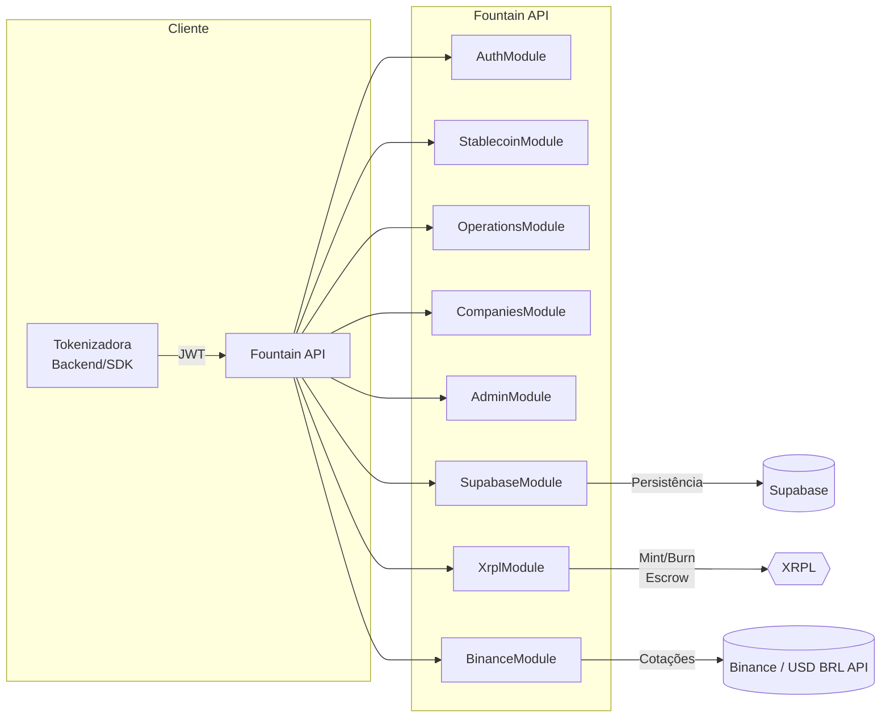

Fountain API é uma plataforma B2B para tokenizadoras automatizarem emissões, gestão e liquidação de stablecoins lastreadas em BRL diretamente na XRP Ledger (XRPL). Esta seção reúne os tópicos fundamentais para operar o backend: arquitetura, configuração, segurança, módulos e fluxos operacionais.

Use o menu lateral para navegar por cada área:

- **Autenticação** – Login, middlewares, controle de acesso
- **Stablecoins** – Fluxos de mint/burn, webhooks, status
- **Operações** – Monitoramento de carteiras temporárias e histórico
- **Empresas** – Dashboards e relatórios financeiros por tokenizadora
- **Administração** – Painéis globais, auditoria e governança
- **Infraestrutura** – Serviços de suporte (XRPL, Supabase, Binance, logger)

## Stack Técnica

- **Framework:** NestJS + Express
- **Banco operacional:** Supabase (PostgreSQL + Realtime)
- **Ledger:** XRP Ledger (Testnet no piloto)
- **Autenticação:** JWT (7 dias) com escopos por empresa
- **Documentação interativa:** Swagger em `/api/docs`
- **SDKs:** TypeScript, JavaScript e Python via `generate-sdk.sh`



## Fluxo de Provisionamento

1. **Bootstrap**
   - `npm install`
   - Crie `.env` com chaves mínimas (ver [Configuração](#configuracao-minima)).
   - Gere chave AES para criptografar carteiras temporárias `openssl rand -base64 32`.
2. **Execução**
   - `npm run start:dev` ou `npm run start:prod`
   - API disponível em `http://localhost:3000`
   - Swagger: `http://localhost:3000/api/docs`
3. **Login**
   - `POST /api/v1/auth` com email autorizado (ver `COMPANIES.md`)
   - Receba JWT (7 dias) com `companyId`, `companyName`, `isAdmin`
4. **Operações**
   - Crie stablecoins via `POST /api/v1/stablecoin`
   - Acompanhe depósitos com `GET /api/v1/operations/:id/temp-wallet`
   - Execute burn via `POST /api/v1/stablecoin/burn`

## Configuração Mínima

Crie `.env` na raiz de `fountain-api/`:

```
NODE_ENV=development
PORT=3000
JWT_SECRET=super-secret
JWT_EXPIRATION=7d
XRPL_NETWORK=testnet
XRPL_ISSUER_ADDRESS=rQhWct2fv4Vc4KRjRgMrxa8xPN9Zx9iLKV
XRPL_ISSUER_SEED=sEd75YpKSqbW5sRTGktUddFWPPX7vT9
ENABLE_XRPL_SUBSCRIBER=true
USD_BRL_RATE=5.25
SUPABASE_URL=https://<project>.supabase.co
SUPABASE_SERVICE_ROLE_KEY=<service-role>
WALLET_ENCRYPTION_KEY=<openssl rand -base64 32>
```

- `SUPABASE_*` pode ser omitido em modo offline (alguns endpoints retornam mocks).
- `WALLET_ENCRYPTION_KEY` é obrigatório; usado para criptografar seeds das carteiras temporárias.
- `USD_BRL_RATE` atua como fallback quando não há cotação online.

## Trilhas Principais

### 1. Emissão On-chain (RLUSD)

1. Tokenizadora envia `POST /stablecoin` com `depositType=RLUSD`.
2. API gera carteira temporária XRPL, calcula RLUSD requerido, ativa wallet com 1.3 XRP e inicia listener.
3. Após depósito RLUSD:
   - Atualiza operação para `deposit_confirmed`.
   - Executa `Payment` XRPL, transferindo emissões para `companyWallet`.
   - Envia webhook `mint.stablecoin.completed`.
4. Agenda `AccountDelete` da carteira temporária após 16 ledgers.

### 2. Liquidação Off-chain (PIX)

1. Requisição `POST /stablecoin` com `depositType=PIX`.
2. API devolve QR Code dinâmico e status `waiting_payment`.
3. Conciliação manual (piloto) move status para `active` ao receber comprovante.

### 3. Queima (Burn)

1. `POST /stablecoin/burn` com `returnAsset` RLUSD ou PIX.
2. Sistema executa `Clawback` XRPL, atualiza operação e dispara webhook `burn.stablecoin.completed`.

Detalhes completos nos tópicos específicos (`Stablecoins`, `Operações`, `Infraestrutura`).

## Segurança & Compliance

- **JWT Middleware:** injeta `req.claims` e `req.user` em toda rota protegida.
- **Admin Middleware:** restringe `/api/v1/admin/**` a contas com `isAdmin=true`.
- **Supabase Allowed Emails:** tabela `allowed_emails` define quem pode autenticar.
- **Criptografia AES-GCM:** seeds de carteiras temporárias guardadas em Supabase são criptografadas com `WALLET_ENCRYPTION_KEY`.
- **Logs Estruturados:** `CustomLogger` emite cabeçalhos com status, cálculos e hashes de transações (ver `Infraestrutura → Observabilidade`).

## Quando Usar Cada Documento

- **Autenticação:** se precisa criar tokens, entender claims ou middlewares.
- **Stablecoins:** para fluxos de mint/burn, status, webhooks e timeouts.
- **Operações:** monitoramento de carteiras temporárias, polling, histórico de depósitos.
- **Empresas:** dashboards financeiros, filtros de período, relatórios.
- **Admin:** visão 360º, auditoria e extração de dados para governança.
- **Infraestrutura:** XRPL service, Supabase, Binance, logger, scripts auxiliares.

## Scripts Úteis

- `./generate-sdk.sh` – Gera SDKs em TS/JS/Python a partir do OpenAPI.
- `./test-api.sh` – Fluxo completo (auth → mint → burn) com validação automática.
- `node scripts/trustline.js` – Configura trustline RLUSD no Testnet.
- `node scripts/simulate-deposit.js` – Simula depósito RLUSD para testes locais.

## Próximos Passos

1. Explore **Autenticação** para obter JWT válido.
2. Vá para **Stablecoins** e siga o passo a passo de emissão.
3. Use **Operações** para monitorar depósitos/escrow.
4. Em produção, utilize **Admin** e **Infraestrutura** como referência para observabilidade e integrações.

