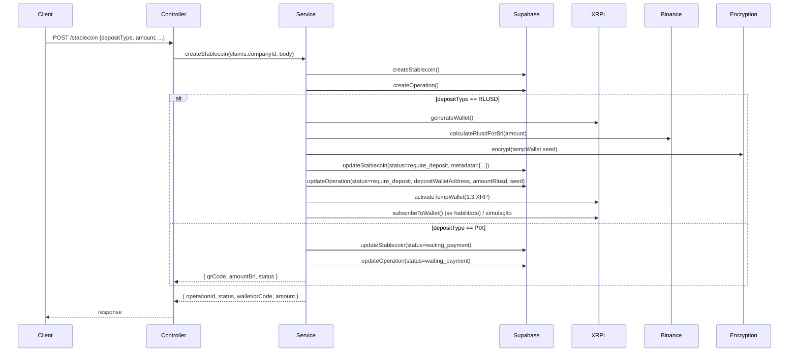

Módulo responsável por toda a jornada de emissão (`mint`), queima (`burn`) e consulta de stablecoins. Abrange geração de carteiras temporárias, integração XRPL, cálculo de colateral, webhooks e estados persistidos no Supabase.

## Visão Geral do Módulo

- **Arquivos principais:** `src/stablecoin/stablecoin.controller.ts`, `stablecoin.service.ts`, DTOs em `stablecoin/dto`
- **Rotas base:** `/api/v1/stablecoin`
- **Dependências internas:** `XrplService`, `BinanceService`, `SupabaseService`, `EncryptionService`, `ConfigService`, `CustomLogger`
- **Entidades persistidas:** tabelas `stablecoins` e `operations` (Supabase)
- **Status chave:**
  - `OperationStatus`: `pending`, `require_deposit`, `partial_deposit`, `deposit_confirmed`, `completed`, `failed`, `cancelled`
  - `StablecoinStatus`: `pending_setup`, `require_deposit`, `waiting_payment`, `active`, `inactive`

## Endpoints

| Método | Rota                         | Descrição                                                             |
| ------ | ---------------------------- | --------------------------------------------------------------------- |
| `POST` | `/api/v1/stablecoin`         | Cria stablecoin, gera carteira temporária ou QR Pix                   |
| `POST` | `/api/v1/stablecoin/mint`    | Emissão adicional (mockado no MVP)                                    |
| `POST` | `/api/v1/stablecoin/burn`    | Queima stablecoin e devolve colateral (RLUSD/PIX)                     |
| `GET`  | `/api/v1/stablecoin/:id`     | Recupera detalhes (metadados, status, histórico)                      |

Todos exigem `Authorization: Bearer <JWT>`.

## DTOs e Validações

- `CreateStablecoinDto`
  - `currencyCode` limitado a 20 caracteres
  - `depositType` enum `['RLUSD', 'PIX']`
  - `companyWallet` deve casar com regex `^r[a-zA-Z0-9]{24,33}$`
- `MintDto` (emissão adicional, ainda mock)
- `BurnDto`
  - `returnAsset` enum `['RLUSD', 'PIX']`
  - Queima calculada em BRL; conversão para RLUSD feita via `BinanceService`

## Fluxo de Criação (`POST /stablecoin`)



### Resposta RLUSD (exemplo)

```json
{
  "operationId": "8c430b52-5f6f-4ea5-9cd2-6a28adf0b3d5",
  "status": "require_deposit",
  "amountRLUSD": "2476.190476",
  "wallet": "rfN9Lus1QxGgJBTQNzxLh4nPfmi5Jj7s6c"
}
```

### Resposta PIX (exemplo)

```json
{
  "operationId": "d3e41cda-4c2b-4c41-8204-7cb09506d12a",
  "status": "waiting_payment",
  "currencyCode": "PABRL",
  "qrCode": "00020126580014br.gov.bcb.pix...mock-d3e41cda",
  "amountBrl": 13000
}
```

## Depósitos RLUSD e Execução do Mint

1. Carteira temporária é ativada com 1.3 XRP (para taxas/minimum reserve).
2. Listener WebSocket (`subscribeToWallet`) monitora depósitos. Se desativado (`ENABLE_XRPL_SUBSCRIBER=false`), é simulada uma confirmação após 5s.
3. `confirmDeposit()`:
   - Usa `SupabaseService.accumulateDeposit()` para somar o valor recebido e registrar histórico (`deposit_history`).
   - Atualiza status para `partial_deposit` até atingir `rlusd_required`.
   - Quando a meta é alcançada, muda para `deposit_confirmed`, cancela a inscrição (`unsubscribeFromWallet`) e chama `executeMint()`.
4. `executeMint()`:
   - Usa `XrplService.mint()` com `Payment` do emissor (`XRPL_ISSUER_SEED`) para a `companyWallet`.
   - Persiste `txHash`, muda `OperationStatus` para `completed`.
   - Dispara webhook `mint.stablecoin.completed`.
   - Agenda limpeza via listener de ledger (16 ledgers após criação).

### Histórico de Depósitos (Supabase `operations.deposit_history`)

```json
[
  {
    "amount": 1238.095238,
    "txHash": "C16F2C1A...",
    "timestamp": "2024-11-11T12:34:56.000Z"
  },
  {
    "amount": 1238.095238,
    "txHash": "F342A9EE...",
    "timestamp": "2024-11-11T12:38:02.000Z"
  }
]
```

## Queima (`POST /stablecoin/burn`)

```bash
curl -X POST http://localhost:3000/api/v1/stablecoin/burn \
  -H "Authorization: Bearer <JWT>" \
  -H "Content-Type: application/json" \
  -d '{
    "stablecoinId": "e25d9f4a-7b7f-4f9b-ab06-70d4220eaec1",
    "currencyCode": "PABRL",
    "amountBrl": 5000,
    "returnAsset": "RLUSD",
    "webhookUrl": "https://client.com/webhooks/fountain"
  }'
```

### Passos Internos

1. Busca stablecoin (`SupabaseService.getStablecoin`).
2. Valida saldo disponível (`operation.amount >= amountBrl`).
3. Obtém cotação `USD_BRL_RATE` (`BinanceService`).
4. Converte BRL → RLUSD (`amountBrl / usdBrl`).
5. Cria operação `type=BURN` em `operations`.
6. Executa `XrplService.clawback()` para remover saldo da carteira do cliente.
7. Atualiza operação para `completed`, registra `txHash`.
8. Envia webhook `burn.stablecoin.completed`.

### Resposta

```json
{
  "operationId": "0d55bd1c-cccb-400e-b841-1f19d0483358",
  "status": "completed",
  "amountBrlBurned": 5000,
  "amountRlusdReturned": "952.380952"
}
```

## Consulta (`GET /stablecoin/:id`)

Retorna a linha da tabela `stablecoins` enriquecida com metadados. Autorização: somente admin ou a própria empresa (`metadata.companyId === claims.companyId`).

```json
{
  "id": "e25d9f4a-7b7f-4f9b-ab06-70d4220eaec1",
  "client_id": "client-123",
  "name": "Park America Building",
  "client_wallet": "rN7n7otQDd6FczFgLdcqpHnZc5LiMvMPAr",
  "currency_code": "PABRL",
  "deposit_mode": "RLUSD",
  "status": "active",
  "metadata": {
    "companyId": "company-1",
    "tempWalletAddress": "rfN9Lus1QxGgJBTQNzxLh4nPfmi5Jj7s6c",
    "rlusdRequired": 2476.190476
  },
  "created_at": "2024-11-11T12:30:12.123Z"
}
```

## Limpeza de Carteiras Temporárias

- `XrplService` observa `ledgerClosed`.
- `SupabaseService.getPendingTempWalletCleanups()` filtra operações com `status ∈ {deposit_confirmed, completed}` e sem `temp_wallet_deleted_at`.
- Após 16 ledgers, `StablecoinService.cleanupTempWallet()`:
  - Descriptografa seed (AES-256-GCM).
  - Executa `AccountDelete`, transferindo saldo remanescente para `XRPL_ISSUER_ADDRESS`.
  - Atualiza metadados com `tempWalletDeletedAt` e `tempWalletDeleteTxHash`.

## Erros e Exceções

- `UnauthorizedException` – JWT sem `companyId` válido.
- `ConflictException` – `currencyCode` duplicado (constraint Supabase).
- `NotFoundException` – Stablecoin inexistente ou fora do escopo do usuário.
- `Failed to activate temp wallet` – falha ao financiar carteira temporária (ver saldo do emissor).
- `Mint failed: Trust line missing...` – é obrigatório configurar trustline `currencyCode` → `companyWallet`.

## Webhooks

- Chamados com `POST` no `webhookUrl` definido no DTO.
- Payload padrão:

```json
{
  "event": "mint.stablecoin.completed",
  "data": {
    "operationId": "8c430b52-5f6f-4ea5-9cd2-6a28adf0b3d5",
    "stablecoinId": "e25d9f4a-7b7f-4f9b-ab06-70d4220eaec1",
    "status": "completed",
    "totalDeposited": 2476.190476
  },
  "timestamp": "2024-11-11T12:42:00.000Z"
}
```

- Logs de entrega via `CustomLogger.logWebhookDelivery`. Falhas não bloqueiam a operação (apenas logam).

## Dicas Operacionais

- **Carteira temporária** precisa de trustline RLUSD? Não. Ela só recebe RLUSD; trustline não é necessária para quem envia RLUSD.
- **companyWallet** deve possuir trustline com emissor antes do mint.
- **Recalcular RLUSD**: `rlusdRequired = amount / USD_BRL_RATE`. Ajuste `USD_BRL_RATE` no `.env` ou forneça cotações em tempo real.
- **Monitoring**: use `GET /operations/:operationId/temp-wallet` (ver seção **Operações**).
- **Reemissão**: `POST /stablecoin/mint` ainda não executa on-chain; planeje MVP V2 para consolidar lógica.

## Recursos Relacionados

- **Operações:** Consulta de status e wallets temporárias.
- **Infraestrutura → XRPL Service:** Todos os métodos XRPL usados aqui.
- **SDK Quickstart:** exemplos de integrações prontos (`fountain-api/SDK_QUICKSTART.md`).

