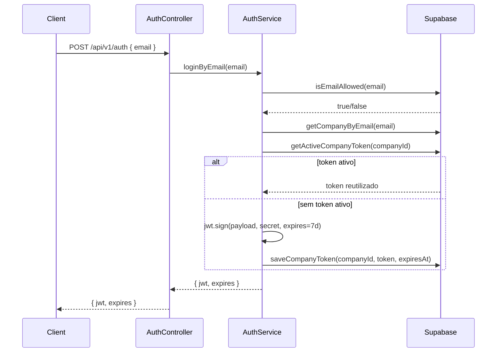

Esta seção detalha como o módulo `AuthModule` controla acesso à Fountain API. Abrange endpoints, middlewares, validações, tabelas Supabase envolvidas e payloads de JWT.

## Visão Geral do Módulo

- **Arquivos principais:** `src/auth/auth.controller.ts`, `auth.service.ts`, `jwt.middleware.ts`, `admin.middleware.ts`
- **Base URL:** `POST /api/v1/auth`
- **Tabelas Supabase:** `allowed_emails`, `companies`, `auth_tokens`
- **Dependências:** `SupabaseService`, `ConfigService`, `CustomLogger`



## Endpoint `POST /api/v1/auth`

### Request

```json
{
  "email": "admin@sonica.com"
}
```

- `email` deve existir em `allowed_emails`.
- O email é normalizado para minúsculas e espaços são descartados.

### Response

```json
{
  "jwt": "eyJhbGciOiJIUzI1NiIsInR5cCI6IkpXVCJ9...",
  "expires": "7d"
}
```

### Payload do JWT

```json
{
  "email": "admin@sonica.com",
  "companyId": "company-1",
  "companyName": "Sonica Tokenizadora",
  "isAdmin": false,
  "iat": 1710000000,
  "exp": 1710604800
}
```

- Token padrão expira em `JWT_EXPIRATION` (default `7d`).
- Tokens ativos são reaproveitados (`auth_tokens`), evitando gerar um novo a cada login.

## Controle de Acesso

### Middleware JWT (`JwtMiddleware`)

- Aplicado automaticamente nos módulos: Stablecoin, Operations, Companies.
- Extrai `Authorization: Bearer <token>`.
- Tolera cabeçalhos `Bearer Bearer <token>` (corrige duplicações do Swagger).
- Injeta `req.claims` e `req.user` com o payload decodificado.
- Gera `UnauthorizedException` para tokens ausentes, inválidos ou expirados.

### Middleware Admin (`AdminMiddleware`)

- Protege as rotas `/api/v1/admin/**`.
- Garante que `decoded.isAdmin === true`.
- Lança `ForbiddenException` caso não seja admin ou header ausente.
- Usa a mesma lógica de extração/verificação do middleware JWT.

### Claims Disponíveis

| Campo       | Descrição                                                 |
| ----------- | --------------------------------------------------------- |
| `email`     | Email autorizado (chave primária para dashboards)         |
| `companyId` | Identificador aplicado em stablecoins, operações, logs    |
| `companyName` | Nome amigável da tokenizadora                           |
| `isAdmin`   | Controle de acesso a rotas administrativas                |

## Tabelas Supabase Relacionadas

- `allowed_emails` – Lista branca controlada manualmente.
- `companies` – Mapeia `email → company_id`, `company_name`, `is_admin`.
- `auth_tokens` – Persistência de tokens ativos (evita JWT duplicado por período).

### Esquema de `auth_tokens`

| Campo          | Tipo        | Descrição                          |
| -------------- | ----------- | ---------------------------------- |
| `company_id`   | `text`      | Normalmente o email normalizado    |
| `token`        | `text`      | JWT emitido                        |
| `expires_at`   | `timestamptz` | Data de expiração ISO             |
| `created_at`   | `timestamptz` | Preenchido automaticamente        |

## Fluxos de Erro

- `400 Bad Request` – Campo `email` ausente ou inválido.
- `401 Unauthorized` – Email não cadastrado em `allowed_emails` ou sem `company`.
- `401 Unauthorized` – Token vencido ao passar pelo `JwtMiddleware`.
- `403 Forbidden` – Acesso a rotas admin sem `isAdmin: true`.

### Tratamento de erros relevantes (`AuthService`)

```typescript
if (!allowed) {
  throw new UnauthorizedException('Email not authorized');
}

if (!company) {
  throw new UnauthorizedException(`No company found for email: ${normalized}`);
}
```

## Boas Práticas

- Armazene o JWT no backend da tokenizadora; evite expô-lo em clientes públicos.
- Renove tokens antecipadamente se o fluxo durar >7 dias.
- Modele automações para limpar registros antigos de `auth_tokens` se necessário.
- Para ambientes locais sem Supabase, adapte `SupabaseService` ou use mocks (ver `Infraestrutura`).

## Próximos Passos

- Prossiga para a seção **Stablecoins** e utilize o JWT obtido para criar emissões.
- Consulte **Administração** para entender os escopos liberados quando `isAdmin=true`.

