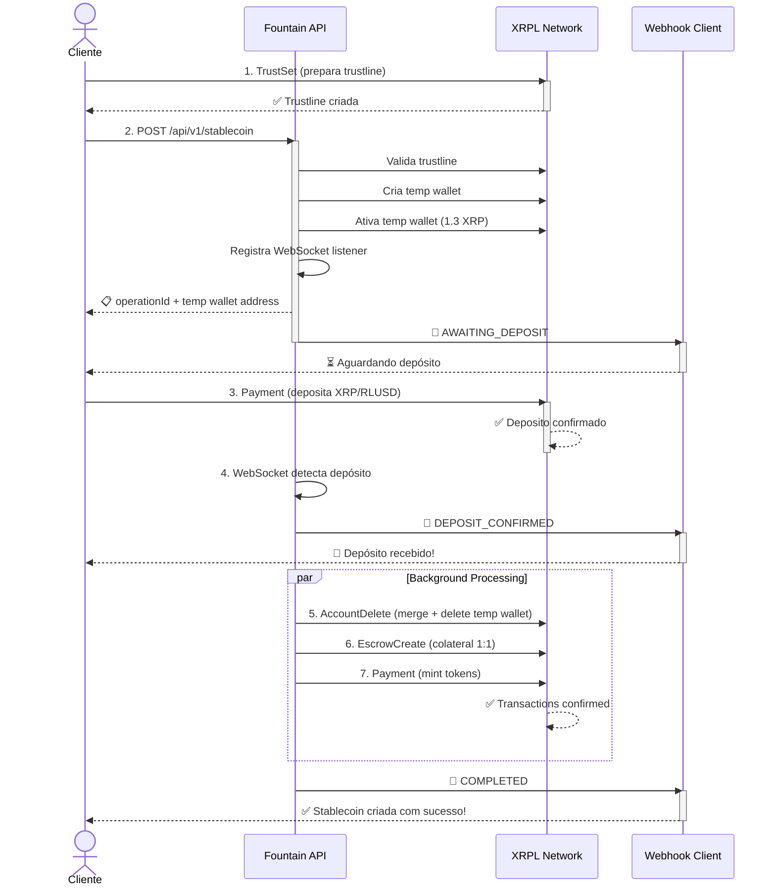
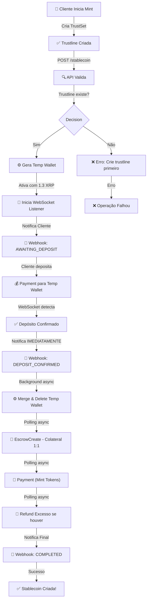
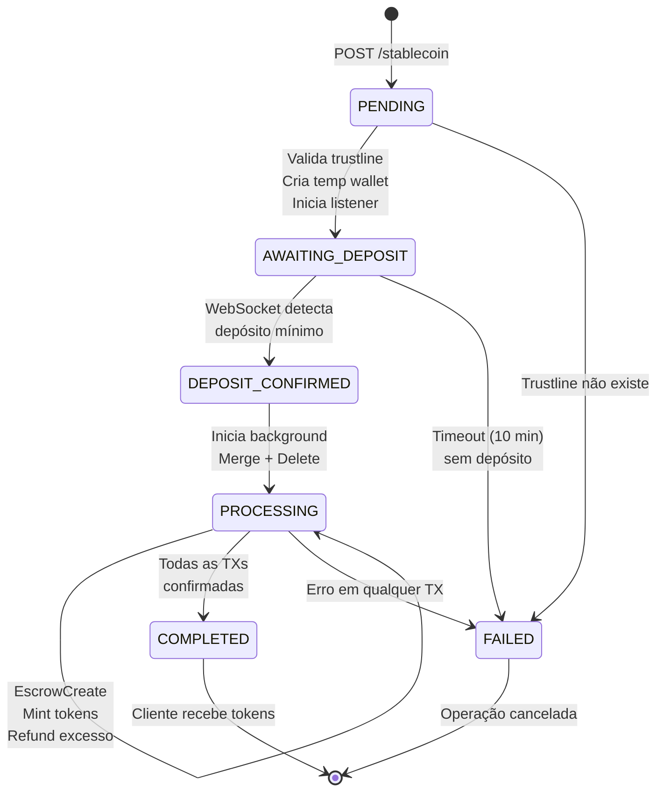
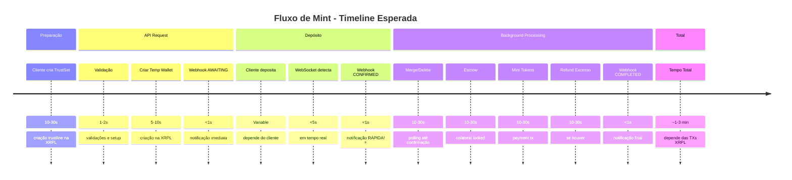
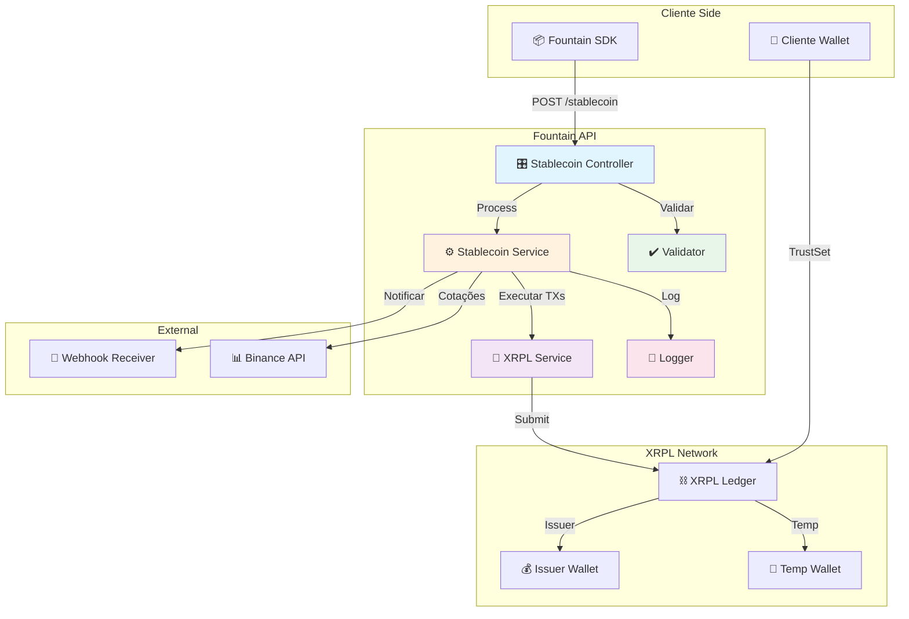

# Fluxos Completos

Detalhamento técnico passo a passo dos fluxos de mint e burn com XRP e RLUSD.

## Atores do sistema

- **Backend (Fountain API)**: Sistema que gerencia stablecoins
- **Issuer Wallet**: Carteira do Fountain que emite tokens
- **Cliente (Tokenizador)**: Empresa que cria stablecoins (ex: Sonica)
- **Company Wallet**: Carteira XRPL do cliente onde tokens são recebidos
- **End-User**: Cliente final do tokenizador (ex: investidor)
- **Temp Wallet**: Carteira temporária criada pelo backend para receber depósitos

---

## Fluxo 1: Depósito XRP → Mint Stablecoin

### Fase 1: Setup (Cliente → Backend)

#### 1. Cliente cria trustline para o stablecoin

**Antes de chamar a API**, o cliente precisa estabelecer confiança no issuer:

```javascript
{
  TransactionType: "TrustSet",
  Account: "rCompanyWallet123...",        // Carteira do cliente
  LimitAmount: {
    currency: "BRL",                      // Código do stablecoin
    issuer: "rIssuerWallet456...",        // Carteira do Fountain (issuer)
    value: "10000000"                     // Limite máximo
  },
  Fee: "12"
}
```

:::danger Crítico
Sem trustline, o mint falhará. O cliente **DEVE** criar o trustline ANTES de chamar a API.
:::

#### 2. Cliente chama API para criar stablecoin

```bash
POST /api/v1/stablecoin
```

**Payload:**

```json
{
  "companyId": "sonica-main",
  "clientId": "cliente-123",
  "companyWallet": "rCompanyWallet123...",
  "clientName": "Apartamento 501",
  "currencyCode": "BRL",
  "amount": 10000,
  "depositType": "XRP",
  "webhookUrl": "https://sonica.com/webhook"
}
```

**Resposta:**

```json
{
  "operationId": "uuid-operation-123",
  "status": "require_deposit",
  "amountXRP": 350.877,
  "wallet": "rTempWallet789...",
  "rateXrpBrl": 28.5
}
```

### Fase 2: Processamento Backend (Automático)

#### 3. Backend cria temp wallet

1. Gera nova carteira XRPL (address + seed)
2. Criptografa seed com AES-256-GCM
3. Armazena no banco de dados

**Resultado:**
- Temp Wallet Address: `rTempWallet789...`
- Encrypted Seed: `iv:encrypted:authTag` (guardado no DB)

#### 4. Backend calcula XRP necessário

```javascript
// 1. Busca taxa XRP/BRL da Binance
const xrpUsdt = await binance.getPrice('XRPUSDT');

// 2. Converte USDT para BRL
const xrpBrl = xrpUsdt * usdBrlRate;

// 3. Calcula XRP necessário
const xrpNeeded = amountBrl / xrpBrl;
```

**Exemplo:**
- Cliente quer: 10.000 BRL
- Taxa XRP/USDT: 0.54
- Taxa USD/BRL: 5.25
- Taxa XRP/BRL: 0.54 × 5.25 = 2.835 BRL/XRP
- **XRP necessário: 10.000 / 2.835 = 3.527,34 XRP**

#### 5. Backend ativa temp wallet

Envia 1.3 XRP do Issuer Wallet para Temp Wallet:

```javascript
{
  TransactionType: "Payment",
  Account: "rIssuerWallet456...",
  Destination: "rTempWallet789...",
  Amount: "1300000",  // 1.3 XRP em drops
  Fee: "12"
}
```

**Por quê 1.3 XRP?**
- XRPL exige reserve mínimo (10 XRP base + 2 XRP por objeto)
- 1.3 XRP é suficiente para ativar a conta

#### 6. Backend subscreve para monitorar depósitos

```javascript
// WebSocket subscription
{
  "command": "subscribe",
  "accounts": ["rTempWallet789..."]
}

// Listener monitora:
// - Transações tipo "Payment"
// - Destination = rTempWallet789...
// - Extrai Amount (em drops para XRP)
```

**Fallback:** Polling a cada 5 segundos se WebSocket falhar.

### Fase 3: Cliente Deposita (Cliente → Temp Wallet)

#### 7. Cliente envia XRP para temp wallet

```javascript
{
  TransactionType: "Payment",
  Account: "rClientSourceWallet...",
  Destination: "rTempWallet789...",
  Amount: "3527340000",  // 3.527,34 XRP em drops
  Fee: "12"
}
```

:::tip Depósitos parciais suportados
Você pode fazer múltiplos depósitos:
- Depósito 1: 1.000 XRP
- Depósito 2: 1.000 XRP
- Depósito 3: 1.527,34 XRP
- **TOTAL: 3.527,34 XRP ✅**
:::

**Backend detecta:**
- WebSocket recebe evento "transaction"
- Extrai `tx.transaction.Amount` (string em drops)
- Converte: `drops / 1.000.000 = XRP`
- Usa `tx.transaction.hash` para detectar duplicatas

### Fase 4: Backend Confirma e Minta (Automático)

#### 8. Backend acumula depósitos

Para cada depósito detectado:

1. Verifica duplicata (txHash já existe?)
2. Se novo, adiciona ao histórico:
   ```json
   {
     "amount": 1000,
     "txHash": "DEF456...",
     "timestamp": "2025-01-10T10:30:00Z"
   }
   ```
3. Soma total depositado
4. Calcula progresso: `(total / required) × 100`

**Atualiza no DB:**
- `amount_deposited += novo_deposito`
- `deposit_count += 1`
- `deposit_history.push({amount, txHash, timestamp})`
- `status = "partial_deposit"` (se ainda falta)

#### 9. Backend valida total e executa mint

Quando `total >= required`:

**Validações:**
1. Total depositado >= XRP necessário? ✅
2. Company wallet tem trustline? (query `account_lines`) ✅
3. Trustline tem limite suficiente? ✅

**Se tudo OK, executa mint:**

```javascript
{
  TransactionType: "Payment",
  Account: "rIssuerWallet456...",         // Issuer (Fountain)
  Destination: "rCompanyWallet123...",    // Cliente
  Amount: {
    currency: "BRL",
    issuer: "rIssuerWallet456...",
    value: "10000"                        // Quantidade em BRL
  },
  Fee: "12"
}
```

**Resultado:**
- Cliente recebe 10.000 BRL tokens
- Tokens aparecem na carteira XRPL do cliente
- Status = "completed"

#### 10. Backend limpa temp wallet

Após **16 ledgers** (~1 minuto):

```javascript
{
  TransactionType: "AccountDelete",
  Account: "rTempWallet789...",
  Destination: "rIssuerWallet456...",  // Recebe saldo restante
  Fee: "200000"                        // 0.2 XRP (fee de delete)
}
```

**Resultado:**
- Temp wallet deletada
- Saldo restante volta pro issuer
- Libera reserve de 10 XRP

#### 11. Backend notifica cliente via webhook

```json
{
  "event": "mint.completed",
  "operationId": "uuid-operation-123",
  "status": "completed",
  "amountBRL": 10000,
  "amountXRPDeposited": 3527.34,
  "txHash": "MINT_TX_HASH_123...",
  "companyWallet": "rCompanyWallet123...",
  "timestamp": "2025-01-10T11:00:00Z"
}
```

---

## Fluxo 2: Depósito RLUSD → Mint Stablecoin

### Diferenças em relação ao XRP

#### Fase 1: Setup

**Cliente cria DUAS trustlines** (ANTES de chamar API):

**Trustline 1: Para RLUSD**
```javascript
{
  TransactionType: "TrustSet",
  Account: "rCompanyWallet123...",
  LimitAmount: {
    currency: "RLUSD",
    issuer: "rRLUSDIssuer...",  // Issuer oficial do RLUSD
    value: "10000000"
  }
}
```

**Trustline 2: Para stablecoin BRL**
```javascript
{
  TransactionType: "TrustSet",
  Account: "rCompanyWallet123...",
  LimitAmount: {
    currency: "BRL",
    issuer: "rIssuerWallet456...",  // Issuer do Fountain
    value: "10000000"
  }
}
```

:::danger Crítico
RLUSD é issued currency, não é nativo. Precisa trustline para **RECEBER** RLUSD e **RECEBER** stablecoin.
:::

#### Cálculo diferente

```javascript
const rlusdNeeded = amountBrl / usdBrlRate;

// Exemplo:
// - Cliente quer: 10.000 BRL
// - Taxa USD/BRL: 5.25
// - RLUSD necessário: 10.000 / 5.25 = 1.904,76 RLUSD
```

#### Depósito com issued currency

```javascript
{
  TransactionType: "Payment",
  Account: "rClientSourceWallet...",
  Destination: "rTempWallet789...",
  Amount: {
    currency: "RLUSD",
    issuer: "rRLUSDIssuer...",
    value: "1904.76"
  },
  Fee: "12"
}
```

**Backend detecta:**
- `tx.transaction.Amount` é **OBJETO** (não string)
- Extrai `Amount.value` (já em decimal)
- Valida `Amount.currency === "RLUSD"`
- Valida `Amount.issuer === RLUSD_ISSUER_ADDRESS`

:::info
O resto do fluxo (acumulação, validação, mint, cleanup, webhook) é igual ao XRP.
:::

---

## Fluxo 3: Cliente Transfere Tokens para End-Users

### 1. End-User cria trustline

```javascript
{
  TransactionType: "TrustSet",
  Account: "rEndUserWallet...",
  LimitAmount: {
    currency: "BRL",
    issuer: "rIssuerWallet456...",
    value: "1000000"
  },
  Fee: "12"
}
```

### 2. Cliente transfere tokens

```javascript
{
  TransactionType: "Payment",
  Account: "rCompanyWallet123...",
  Destination: "rEndUserWallet...",
  Amount: {
    currency: "BRL",
    issuer: "rIssuerWallet456...",
    value: "1000"
  },
  Fee: "12"
}
```

### 3. End-User verifica saldo

```bash
# Query XRPL account_lines
curl -X POST https://s.altnet.rippletest.net:51234/ \
  -H "Content-Type: application/json" \
  -d '{
    "method": "account_lines",
    "params": [{
      "account": "rEndUserWallet..."
    }]
  }'
```

---

## Fluxo 4: Burn (Resgate) - Cliente → Backend

### 1. Cliente chama API de burn

```bash
POST /api/v1/stablecoin/burn
```

```json
{
  "stablecoinId": "uuid-stablecoin-123",
  "currencyCode": "BRL",
  "amountBrl": 5000,
  "returnAsset": "XRP",
  "webhookUrl": "https://sonica.com/webhook"
}
```

### 2. Backend executa clawback

```javascript
{
  TransactionType: "Clawback",
  Account: "rIssuerWallet456...",      // Issuer
  Amount: {
    currency: "BRL",
    issuer: "rCompanyWallet123...",    // HOLDER (não issuer!)
    value: "5000"
  },
  Fee: "12"
}
```

:::warning Diferença importante
No Clawback, o campo `issuer` dentro de `Amount` é o **HOLDER** (quem tem os tokens), não o issuer real.
:::

### 3. Backend converte e envia XRP

```javascript
// 1. Calcula XRP a devolver
const xrp = amountBrl / rateXrpBrl;
// XRP = 5000 / 2.835 = 1.763,67 XRP

// 2. Envia Payment
{
  TransactionType: "Payment",
  Account: "rIssuerWallet456...",
  Destination: "rCompanyWallet123...",
  Amount: "1763670000",  // 1.763,67 XRP em drops
  Fee: "12"
}
```

### 4. Backend notifica via webhook

```json
{
  "event": "burn.completed",
  "operationId": "uuid-burn-456",
  "status": "completed",
  "amountBrlBurned": 5000,
  "amountXrpReturned": 1763.67,
  "txHashClawback": "CLAWBACK_TX...",
  "txHashReturn": "PAYMENT_TX...",
  "timestamp": "2025-01-10T15:00:00Z"
}
```

---

## Comparação: XRP vs RLUSD

| Aspecto | XRP | RLUSD |
|---------|-----|-------|
| **Trustlines necessárias** | 1 (stablecoin BRL) | 2 (RLUSD + stablecoin BRL) |
| **Tipo de asset** | Native (XRP) | Issued Currency |
| **Detection Amount** | String (drops) | Object {currency, issuer, value} |
| **Conversão** | XRP/BRL direto | USD/BRL intermediário |
| **Complexidade cliente** | Baixa | Alta |
| **Taxa de conversão** | Volátil (Binance) | Estável (RLUSD ≈ 1 USD) |
| **Issuer extra** | Não | Sim (RLUSD issuer) |

---

## Erros comuns e soluções

### "Trust line missing"

**Causa:** Cliente não criou trustline antes do mint
**Solução:** Cliente precisa enviar TrustSet transaction ANTES

### "Insufficient trust line limit"

**Causa:** LimitAmount no TrustSet < valor a receber
**Solução:** Aumentar LimitAmount no TrustSet

### "Account not found"

**Causa:** Tentou enviar para carteira não ativada
**Solução:** Ativar carteira com pagamento >= 10 XRP

### "Insufficient XRP balance"

**Causa:** Temp wallet sem XRP suficiente
**Solução:** Backend ativa com 1.3 XRP automaticamente

### "Duplicate deposit detected"

**Causa:** Mesmo txHash já processado
**Solução:** Sistema ignora automaticamente (proteção)

---

## Resumo de responsabilidades

### Backend (Fountain API)

- ✅ Criar temp wallets
- ✅ Ativar temp wallets com XRP
- ✅ Monitorar depósitos via WebSocket
- ✅ Acumular depósitos parciais
- ✅ Validar trustlines
- ✅ Executar mint (Payment issued currency)
- ✅ Limpar temp wallets (AccountDelete)
- ✅ Executar clawback (burn)
- ✅ Enviar webhooks

### Cliente (Tokenizador)

- ✅ Criar trustline para stablecoin ANTES de mint
- ✅ Criar trustline para RLUSD (se usar RLUSD)
- ✅ Depositar XRP ou RLUSD na temp wallet
- ✅ Receber stablecoins na company wallet
- ✅ Transferir stablecoins para end-users
- ✅ Solicitar burn quando quiser resgatar

### End-User (Investidor)

- ✅ Criar trustline para stablecoin ANTES de receber
- ✅ Receber tokens do cliente via Payment
- ✅ Verificar saldo via account_lines
- ✅ Transferir tokens para outros (opcional)

---

## Diagramas Visuais do Fluxo de Mint

### Sequence Diagram: Interação Cliente → API → XRPL



### Flowchart: Decisões e Passos do Processo



### State Diagram: Estados da Operação



### Timeline: Duração Esperada de Cada Fase



### Architecture Diagram: Componentes Envolvidos



---

## Pontos-Chave do Fluxo

### ⚡ Webhook DEPOSIT_CONFIRMED é RÁPIDO (< 1 segundo!)
- Enviado assim que WebSocket detecta depósito
- **NÃO espera** merge/delete/escrow/mint
- Cliente sabe imediatamente que o depósito foi recebido

### 🔄 Processamento em Background (Não-Bloqueante)
- Merge & Delete: Usa `submit()` + polling async
- Escrow: Locked por 180 dias
- Mint: Emite os tokens
- Tudo acontece em paralelo no background

### ✅ LastLedgerSequence em Tudo
- Todas as transactions têm janela válida (currentLedger + 100)
- ~5 minutos de validade

### 🔐 Currency Code Normalizado
- 3 chars ASCII: USD, BRL, EUR
- 40 chars HEX: Para códigos customizados (APBRL → hex format)

### 🔔 Três Webhooks Enviados
1. **AWAITING_DEPOSIT**: Setup concluído, aguardando depósito
2. **DEPOSIT_CONFIRMED**: Depósito recebido! ⚡ (rápido!)
3. **COMPLETED**: Tudo finalizado, tokens minted
