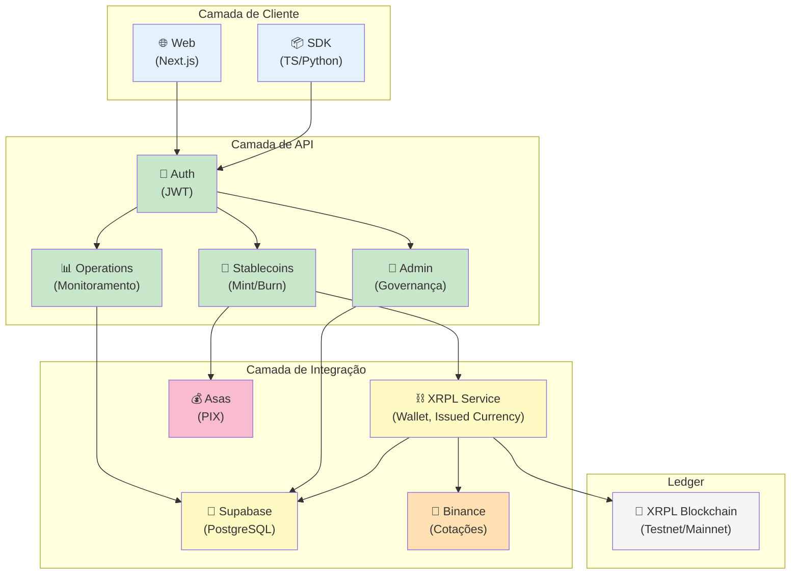

# Arquitetura em Camadas

A plataforma Fountain é dividida em camadas lógicas para garantir escalabilidade, segurança e manutenibilidade.

## Componentes

| Camada | Componente | Descrição |
|---|---|---|
| **Cliente** | Web & SDKs | Interfaces para interação com a API, seja através de um painel web (Next.js) ou programaticamente via SDKs (TypeScript/Python). |
| **API** | Backend (NestJS) | Orquestra todas as operações, valida permissões e gerencia os fluxos de mint e burn. |
| **Integração** | Serviços Externos | Conecta com a XRPL para operações on-chain, Supabase para persistência de dados, Binance para cotações e gateways de pagamento para depósitos/saques via PIX. |
| **Ledger** | XRPL | A blockchain onde as stablecoins são emitidas, transacionadas e resgatadas. |
