# Arquitetura em Camadas

A plataforma Fountain é dividida em camadas lógicas para garantir escalabilidade, segurança e manutenibilidade.

```mermaid
graph TB
    subgraph "Camada de Cliente"
        WEB["🌐 Web<br/>(Next.js)"]
        SDK["📦 SDK<br/>(TS/Python)"]
    end

    subgraph "Camada de API"
        AUTH["🔐 Auth<br/>(JWT)"]
        MINT["💎 Stablecoins<br/>(Mint/Burn)"]
        OPS["📊 Operations<br/>(Monitoramento)"]
        ADMIN["👑 Admin<br/>(Governança)"]
    end

    subgraph "Camada de Integração"
        XRPL_S["⛓️ XRPL Service<br/>(Wallet, Issued Currency)"]
        DB["💾 Supabase<br/>(PostgreSQL)"]
        BINANCE["💱 Binance<br/>(Cotações)"]
        ASAS["💰 Asas<br/>(PIX)"]
    end

    subgraph "Ledger"
        XRPL["🔗 XRPL Blockchain<br/>(Testnet/Mainnet)"]
    end

    WEB --> AUTH
    SDK --> AUTH
    AUTH --> MINT
    AUTH --> OPS
    AUTH --> ADMIN
    MINT --> XRPL_S
    OPS --> DB
    ADMIN --> DB
    XRPL_S --> DB
    XRPL_S --> XRPL
    XRPL_S --> BINANCE
    MINT --> ASAS

    style WEB fill:#e3f2fd
    style SDK fill:#e3f2fd
    style AUTH fill:#c8e6c9
    style MINT fill:#c8e6c9
    style OPS fill:#c8e6c9
    style ADMIN fill:#c8e6c9
    style XRPL_S fill:#fff9c4
    style DB fill:#fff9c4
    style BINANCE fill:#ffe0b2
    style ASAS fill:#f8bbd0
    style XRPL fill:#f5f5f5
```

## Componentes

| Camada | Componente | Descrição |
|---|---|---|
| **Cliente** | Web & SDKs | Interfaces para interação com a API, seja através de um painel web (Next.js) ou programaticamente via SDKs (TypeScript/Python). |
| **API** | Backend (NestJS) | Orquestra todas as operações, valida permissões e gerencia os fluxos de mint e burn. |
| **Integração** | Serviços Externos | Conecta com a XRPL para operações on-chain, Supabase para persistência de dados, Binance para cotações e gateways de pagamento para depósitos/saques via PIX. |
| **Ledger** | XRPL | A blockchain onde as stablecoins são emitidas, transacionadas e resgatadas. |
