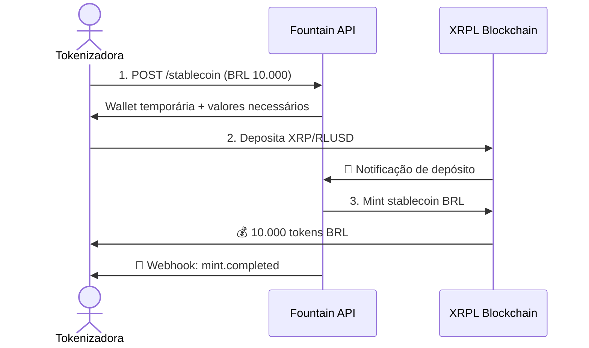
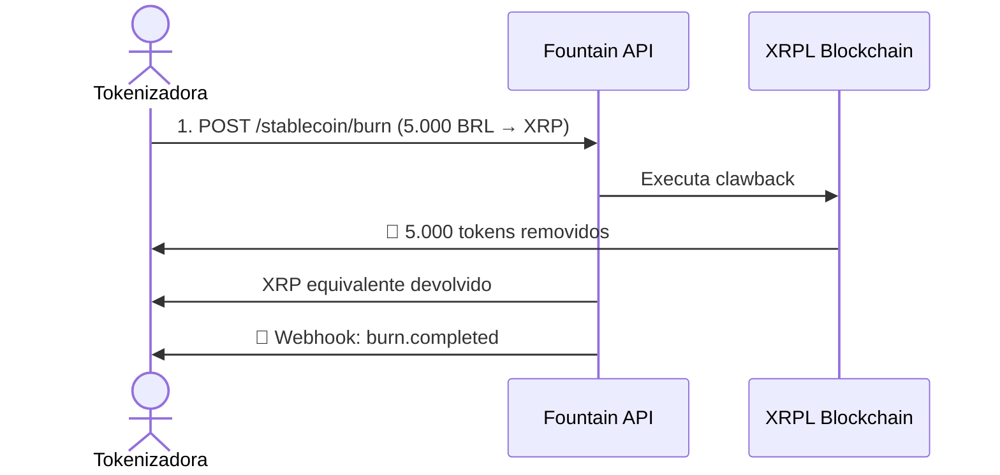

# Fluxos Principais

## Fluxo de Emissão (Mint)

O fluxo de emissão de stablecoins é iniciado por uma tokenizadora e envolve a criação de uma carteira temporária para depósito de colateral.

1.  **Requisição:** A tokenizadora envia uma requisição para a Fountain API para emitir um valor em BRL.
2.  **Depósito:** A API retorna uma carteira temporária para a tokenizadora depositar o colateral (XRP ou RLUSD).
3.  **Confirmação:** A API monitora a carteira e, ao confirmar o depósito, emite os tokens na XRPL.
4.  **Notificação:** A tokenizadora recebe os tokens e uma notificação via webhook.

## Fluxo de Resgate (Burn)

O fluxo de resgate permite que a tokenizadora queime stablecoins e receba o colateral de volta.

1.  **Requisição:** A tokenizadora solicita o resgate de uma quantidade de stablecoins.
2.  **Clawback:** A API executa um `clawback` na XRPL para remover os tokens da carteira da tokenizadora.
3.  **Devolução:** O colateral equivalente é devolvido para a tokenizadora.
4.  **Notificação:** A tokenizadora recebe uma notificação de conclusão via webhook.
