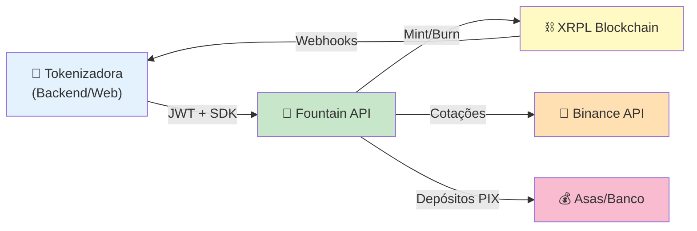
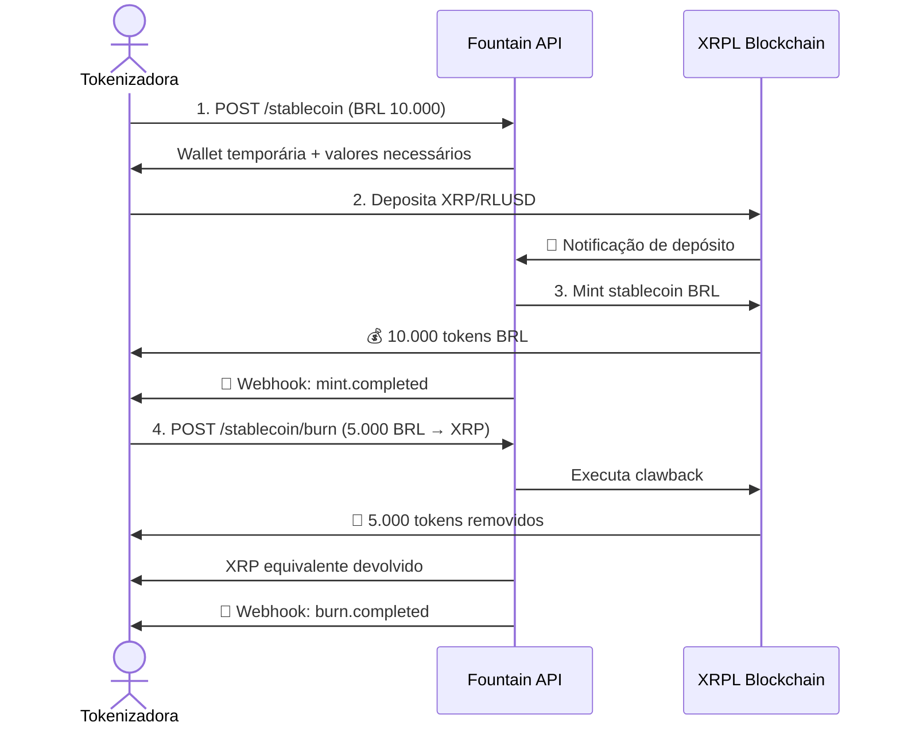
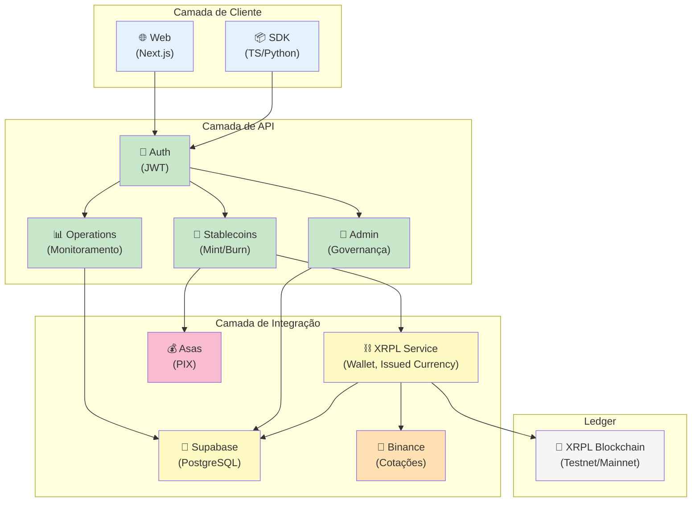

# O que é Fountain?

**Fountain** é uma **infraestrutura completa B2B para automatizar a emissão e gestão de stablecoins em BRL** diretamente na **XRP Ledger (XRPL)**.

## Para Quem?

Tokenizadoras, fintechs e operadores de ativos que precisam:
- ✅ Emitir stablecoins lastreadas em BRL (1:1 com colateral)
- ✅ Aceitar depósitos via on-chain (XRP, RLUSD) ou off-chain (Pix)
- ✅ Executar resgates (burn) de forma automática
- ✅ Gerenciar múltiplos clientes com isolamento de dados
- ✅ Integrar via API REST com SDKs prontos (TypeScript, Python)

## O Problema

Emitir stablecoins é complexo:
- **Compliance**: KYC/AML, auditorias, criptografia
- **Operacional**: Múltiplos depósitos, conversões cambiais, limpeza de carteiras
- **Blockchain**: Issued Currencies, clawback, WebSocket monitoring, fallbacks
- **Integração**: Diferentes gateways (PIX, exchanges, XRPL)

Fountain **abstrai toda essa complexidade** em uma API simples.

## O que Fountain Faz

### 1. **Autenticação Simples**
Empresas fazem login com email autorizado e recebem JWT com 7 dias de validade.

### 2. **Mint (Emissão)**
Crie uma requisição com:
- Tipo de depósito (XRP, RLUSD ou PIX)
- Quantidade em BRL
- Carteira destino

Backend automaticamente:
- Gera carteira temporária (para on-chain) ou QR Pix (para off-chain)
- Calcula cotação em tempo real
- Monitora depósito
- Executa mint na XRPL
- Envia webhook de conclusão

### 3. **Burn (Resgate)**
Resgatar tokens é tão simples quanto mint:
- Especifique cantidad em BRL e ativo de retorno (XRP, RLUSD ou PIX)
- Backend executa clawback (recupera tokens)
- Calcula devolução com cotação em tempo real
- Envia colateral de volta
- Envia webhook de conclusão

### 4. **Operações em Tempo Real**
Monitore:
- Status de depósitos (quanto já foi recebido)
- Histórico de transações
- Wallets temporárias (ativa, pendente, deletada)
- Relatórios financeiros por empresa

### 5. **Administração**
Painel de governança com:
- Estatísticas globais (total de empresas, stablecoins, operações)
- Auditoria de todas as operações
- Monitoramento de carteiras
- Extração de dados para compliance

## Fluxo Simplificado

## Arquitetura em Camadas

## Características Principais

| Recurso | Descrição |
|---------|-----------|
| **Multi-tenant** | Isolamento total de dados por empresa |
| **Real-time** | WebSocket monitoring com fallback a polling |
| **Automático** | Carteiras temporárias com limpeza automática |
| **Seguro** | Criptografia AES-256-GCM de chaves privadas |
| **Escalável** | Supabase realtime + XRPL native scaling |
| **Auditado** | Logs estruturados com hashes de transações |
| **Webhook** | Notificações assíncronas com retry e idempotência |
| **SDKs** | TypeScript e Python prontos para produção |

## Próximos Passos

1. 📚 Leia **[Arquitetura](arquitetura.md)** para entender os componentes
2. 🔄 Veja **[Fluxos Principais](fluxos-principais.md)** para casos de uso
3. 📊 Explore **[Tecnologias](tecnologias.md)** que usamos
4. 🚀 Vá para **[Backend API](../backend/visao-geral.md)** para integrar

---

**Fountain** — Automatização de stablecoins BRL na XRPL para destravar tokenização de ativos reais. 🚀
