# O que é Fountain?

**Fountain** é uma **infraestrutura completa B2B para automatizar a emissão e gestão de stablecoins em BRL** diretamente na **XRP Ledger (XRPL)**.

## Para Quem?

Tokenizadoras, fintechs e operadores de ativos que precisam:
- ✅ Emitir stablecoins lastreadas em BRL (1:1 com colateral)
- ✅ Aceitar depósitos via on-chain (XRP, RLUSD) ou off-chain (Pix)
- ✅ Executar resgates (burn) de forma automática
- ✅ Gerenciar múltiplos clientes com isolamento de dados
- ✅ Integrar via API REST com SDKs prontos (TypeScript, Python)

## O Problema

Emitir stablecoins é complexo:
- **Compliance**: KYC/AML, auditorias, criptografia
- **Operacional**: Múltiplos depósitos, conversões cambiais, limpeza de carteiras
- **Blockchain**: Issued Currencies, clawback, WebSocket monitoring, fallbacks
- **Integração**: Diferentes gateways (PIX, exchanges, XRPL)

Fountain **abstrai toda essa complexidade** em uma API simples.

## O que Fountain Faz

```mermaid
graph LR
    A["🏢 Tokenizadora<br/>(Backend/Web)"] -->|JWT + SDK| B["🔌 Fountain API"]
    B -->|Mint/Burn| C["⛓️ XRPL Blockchain"]
    B -->|Cotações| D["💱 Binance API"]
    B -->|Depósitos PIX| E["💰 Asas/Banco"]
    C -->|Webhooks| A

    style A fill:#e3f2fd
    style B fill:#c8e6c9
    style C fill:#fff9c4
    style D fill:#ffe0b2
    style E fill:#f8bbd0
```

### 1. **Autenticação Simples**
Empresas fazem login com email autorizado e recebem JWT com 7 dias de validade.

### 2. **Mint (Emissão)**
Crie uma requisição com:
- Tipo de depósito (XRP, RLUSD ou PIX)
- Quantidade em BRL
- Carteira destino

Backend automaticamente:
- Gera carteira temporária (para on-chain) ou QR Pix (para off-chain)
- Calcula cotação em tempo real
- Monitora depósito
- Executa mint na XRPL
- Envia webhook de conclusão

### 3. **Burn (Resgate)**
Resgatar tokens é tão simples quanto mint:
- Especifique cantidad em BRL e ativo de retorno (XRP, RLUSD ou PIX)
- Backend executa clawback (recupera tokens)
- Calcula devolução com cotação em tempo real
- Envia colateral de volta
- Envia webhook de conclusão

### 4. **Operações em Tempo Real**
Monitore:
- Status de depósitos (quanto já foi recebido)
- Histórico de transações
- Wallets temporárias (ativa, pendente, deletada)
- Relatórios financeiros por empresa

### 5. **Administração**
Painel de governança com:
- Estatísticas globais (total de empresas, stablecoins, operações)
- Auditoria de todas as operações
- Monitoramento de carteiras
- Extração de dados para compliance

## Fluxo Simplificado

```mermaid
sequenceDiagram
    actor T as Tokenizadora
    participant API as Fountain API
    participant XR as XRPL Blockchain

    T->>API: 1. POST /stablecoin (BRL 10.000)
    API->>T: Wallet temporária + valores necessários
    T->>XR: 2. Deposita XRP/RLUSD
    XR->>API: 🔔 Notificação de depósito
    API->>XR: 3. Mint stablecoin BRL
    XR->>T: 💰 10.000 tokens BRL
    API->>T: 🔔 Webhook: mint.completed

    T->>API: 4. POST /stablecoin/burn (5.000 BRL → XRP)
    API->>XR: Executa clawback
    XR->>T: 💸 5.000 tokens removidos
    API->>T: XRP equivalente devolvido
    API->>T: 🔔 Webhook: burn.completed
```

## Arquitetura em Camadas

```mermaid
graph TB
    subgraph "Camada de Cliente"
        WEB["🌐 Web<br/>(Next.js)"]
        SDK["📦 SDK<br/>(TS/Python)"]
    end

    subgraph "Camada de API"
        AUTH["🔐 Auth<br/>(JWT)"]
        MINT["💎 Stablecoins<br/>(Mint/Burn)"]
        OPS["📊 Operations<br/>(Monitoramento)"]
        ADMIN["👑 Admin<br/>(Governança)"]
    end

    subgraph "Camada de Integração"
        XRPL_S["⛓️ XRPL Service<br/>(Wallet, Issued Currency)"]
        DB["💾 Supabase<br/>(PostgreSQL)"]
        BINANCE["💱 Binance<br/>(Cotações)"]
        ASAS["💰 Asas<br/>(PIX)"]
    end

    subgraph "Ledger"
        XRPL["🔗 XRPL Blockchain<br/>(Testnet/Mainnet)"]
    end

    WEB --> AUTH
    SDK --> AUTH
    AUTH --> MINT
    AUTH --> OPS
    AUTH --> ADMIN
    MINT --> XRPL_S
    OPS --> DB
    ADMIN --> DB
    XRPL_S --> DB
    XRPL_S --> XRPL
    XRPL_S --> BINANCE
    MINT --> ASAS

    style WEB fill:#e3f2fd
    style SDK fill:#e3f2fd
    style AUTH fill:#c8e6c9
    style MINT fill:#c8e6c9
    style OPS fill:#c8e6c9
    style ADMIN fill:#c8e6c9
    style XRPL_S fill:#fff9c4
    style DB fill:#fff9c4
    style BINANCE fill:#ffe0b2
    style ASAS fill:#f8bbd0
    style XRPL fill:#f5f5f5
```

## Características Principais

| Recurso | Descrição |
|---------|-----------|
| **Multi-tenant** | Isolamento total de dados por empresa |
| **Real-time** | WebSocket monitoring com fallback a polling |
| **Automático** | Carteiras temporárias com limpeza automática |
| **Seguro** | Criptografia AES-256-GCM de chaves privadas |
| **Escalável** | Supabase realtime + XRPL native scaling |
| **Auditado** | Logs estruturados com hashes de transações |
| **Webhook** | Notificações assíncronas com retry e idempotência |
| **SDKs** | TypeScript e Python prontos para produção |

## Próximos Passos

1. 📚 Leia **[Arquitetura](arquitetura.md)** para entender os componentes
2. 🔄 Veja **[Fluxos Principais](fluxos-principais.md)** para casos de uso
3. 📊 Explore **[Tecnologias](tecnologias.md)** que usamos
4. 🚀 Vá para **[Backend API](../backend/visao-geral.md)** para integrar

---

**Fountain** — Automatização de stablecoins BRL na XRPL para destravar tokenização de ativos reais. 🚀
