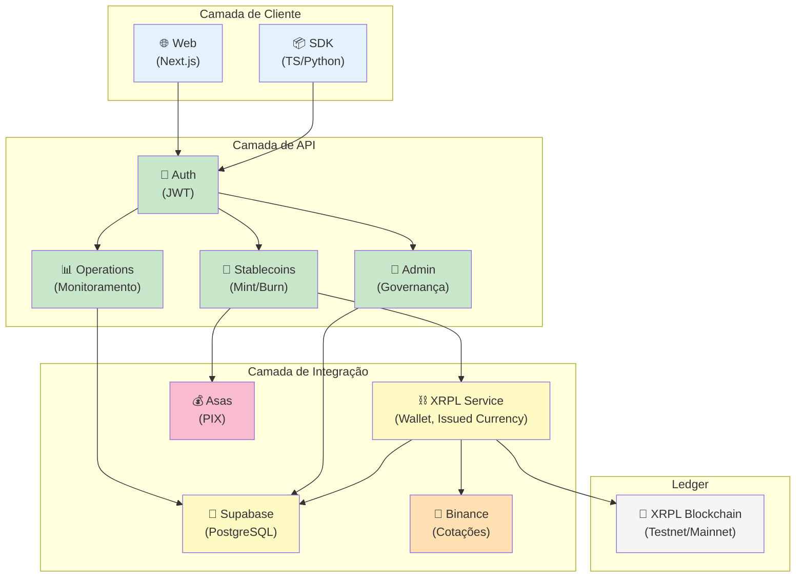
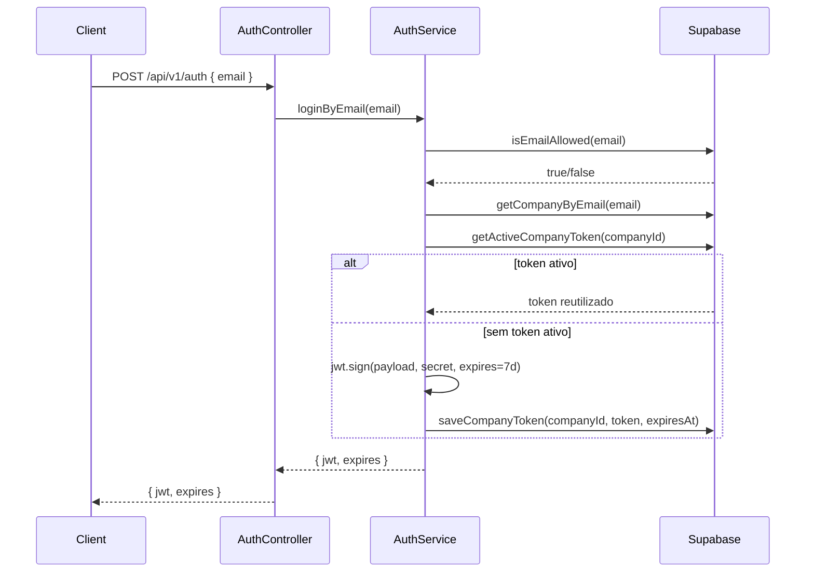
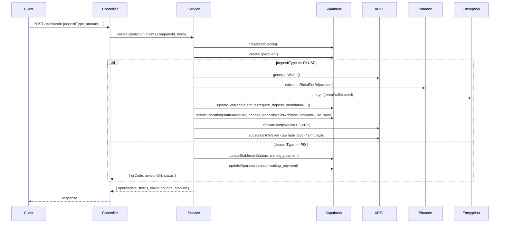
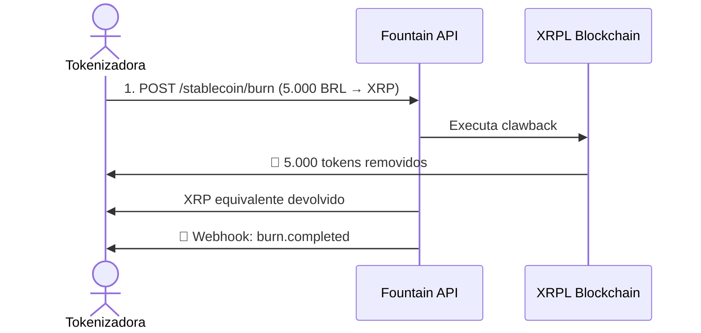

# Diagramas de Referência

Esta seção consolida os principais diagramas de arquitetura e sequência da plataforma Fountain.

## Arquitetura em Camadas

## Fluxo de Autenticação

## Fluxo de Criação de Stablecoin (Mint)

## Fluxo de Resgate (Burn)

