# Diagramas de Referência

Esta seção consolida os principais diagramas de arquitetura e sequência da plataforma Fountain.

## Arquitetura em Camadas

```mermaid
graph TB
    subgraph "Camada de Cliente"
        WEB["🌐 Web<br/>(Next.js)"]
        SDK["📦 SDK<br/>(TS/Python)"]
    end

    subgraph "Camada de API"
        AUTH["🔐 Auth<br/>(JWT)"]
        MINT["💎 Stablecoins<br/>(Mint/Burn)"]
        OPS["📊 Operations<br/>(Monitoramento)"]
        ADMIN["👑 Admin<br/>(Governança)"]
    end

    subgraph "Camada de Integração"
        XRPL_S["⛓️ XRPL Service<br/>(Wallet, Issued Currency)"]
        DB["💾 Supabase<br/>(PostgreSQL)"]
        BINANCE["💱 Binance<br/>(Cotações)"]
        ASAS["💰 Asas<br/>(PIX)"]
    end

    subgraph "Ledger"
        XRPL["🔗 XRPL Blockchain<br/>(Testnet/Mainnet)"]
    end

    WEB --> AUTH
    SDK --> AUTH
    AUTH --> MINT
    AUTH --> OPS
    AUTH --> ADMIN
    MINT --> XRPL_S
    OPS --> DB
    ADMIN --> DB
    XRPL_S --> DB
    XRPL_S --> XRPL
    XRPL_S --> BINANCE
    MINT --> ASAS

    style WEB fill:#e3f2fd
    style SDK fill:#e3f2fd
    style AUTH fill:#c8e6c9
    style MINT fill:#c8e6c9
    style OPS fill:#c8e6c9
    style ADMIN fill:#c8e6c9
    style XRPL_S fill:#fff9c4
    style DB fill:#fff9c4
    style BINANCE fill:#ffe0b2
    style ASAS fill:#f8bbd0
    style XRPL fill:#f5f5f5
```

## Fluxo de Autenticação

## Fluxo de Criação de Stablecoin (Mint)

```mermaid
sequenceDiagram
  participant Client
  participant Controller
  participant Service
  participant Supabase
  participant XRPL
  participant Binance

  Client->>Controller: POST /stablecoin {depositType, amount, ...}
  Controller->>Service: createStablecoin(claims.companyId, body)
  Service->>Supabase: createStablecoin()
  Service->>Supabase: createOperation()
  alt depositType == RLUSD
    Service->>XRPL: generateWallet()
    Service->>Binance: calculateRlusdForBrl(amount)
    Service->>Encryption: encrypt(tempWallet.seed)
    Service->>Supabase: updateStablecoin(status=require_deposit, metadata={...})
    Service->>Supabase: updateOperation(status=require_deposit, depositWalletAddress, amountRlusd, seed)
    Service->>XRPL: activateTempWallet(1.3 XRP)
    Service->>XRPL: subscribeToWallet() (se habilitado) / simulação
  else depositType == PIX
    Service->>Supabase: updateStablecoin(status=waiting_payment)
    Service->>Supabase: updateOperation(status=waiting_payment)
    Service-->>Controller: { qrCode, amountBrl, status }
  end
  Service-->>Controller: { operationId, status, wallet/qrCode, amount }
  Controller-->>Client: response
```

## Fluxo de Resgate (Burn)

```mermaid
sequenceDiagram
    actor T as Tokenizadora
    participant API as Fountain API
    participant XR as XRPL Blockchain

    T->>API: 1. POST /stablecoin/burn (5.000 BRL → XRP)
    API->>XR: Executa clawback
    XR->>T: 💸 5.000 tokens removidos
    API->>T: XRP equivalente devolvido
    API->>T: 🔔 Webhook: burn.completed
```

