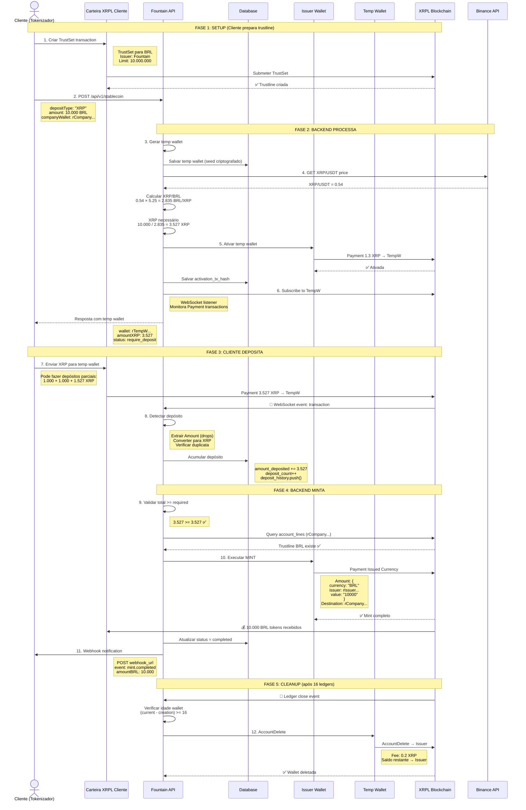
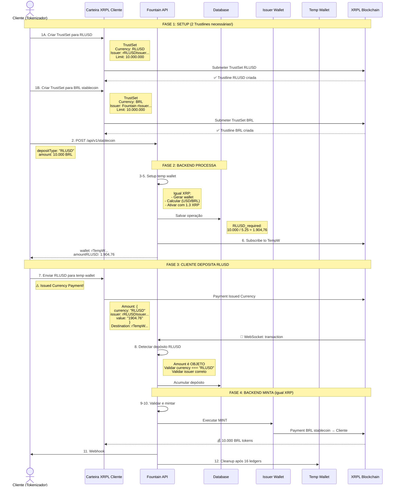
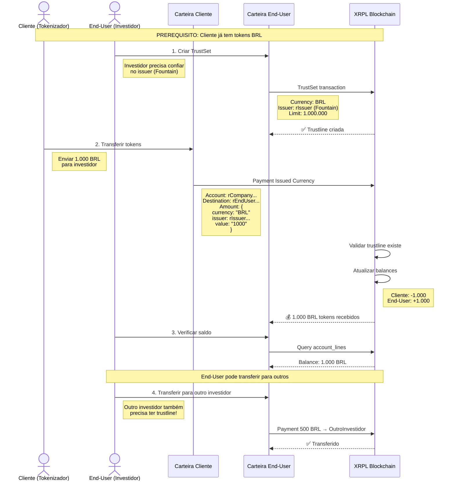
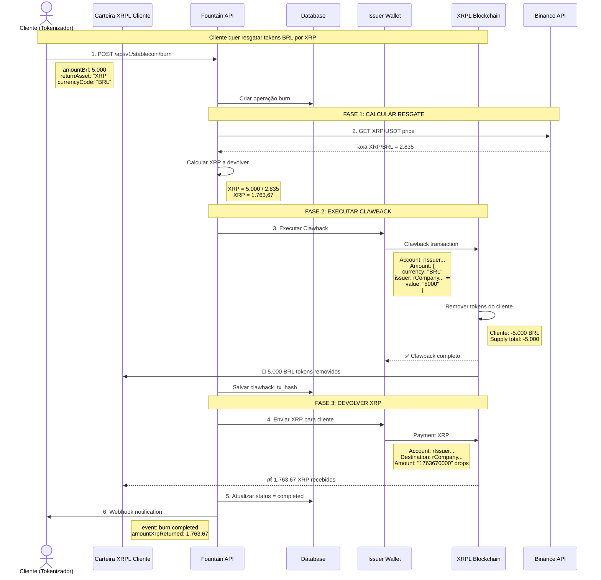
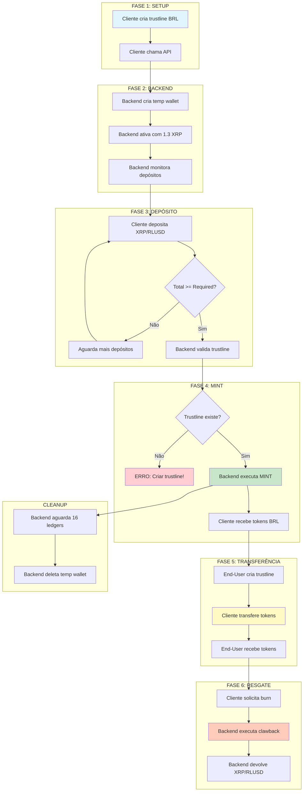

# Diagramas de Sequência - Fountain API

## Diagrama 1: Depósito XRP → Mint Stablecoin

---

## Diagrama 2: Depósito RLUSD → Mint Stablecoin

---

## Diagrama 3: Cliente Transfere para End-Users

---

## Diagrama 4: Burn (Resgate) - Cliente → Backend

---

## Diagrama 5: Fluxo Completo End-to-End (Simplificado)

---

## Legenda dos Diagramas

### Símbolos e Cores

- **🔔** WebSocket event / notificação
- **✅** Sucesso / confirmação
- **💰** Tokens recebidos
- **💸** Tokens removidos (burn)
- **⚠️** Atenção / ponto crítico
- **→** Fluxo de dados
- **⬅️** Nota importante

### Participantes

- **Cliente**: Empresa tokenizadora (Sonica, etc)
- **End-User**: Investidor final que compra tokens
- **API**: Fountain Backend
- **Issuer Wallet**: Carteira do Fountain que emite tokens
- **Temp Wallet**: Carteira temporária para depósitos
- **XRPL**: XRP Ledger blockchain
- **Binance API**: API para cotações

### Tipos de Transação XRPL

1. **TrustSet**: Estabelece confiança em issuer
2. **Payment (XRP)**: Transferência de XRP nativo
3. **Payment (Issued Currency)**: Transferência de token/stablecoin
4. **Clawback**: Recuperação de tokens (burn)
5. **AccountDelete**: Deletar conta e merge saldo

---

## Pontos Críticos de Cada Fluxo

### XRP Deposit
- ✅ Simples: 1 trustline apenas (stablecoin)
- ✅ Amount como string (drops)
- ⚠️ Taxa volátil (XRP/BRL)

### RLUSD Deposit
- ⚠️ Complexo: 2 trustlines (RLUSD + stablecoin)
- ⚠️ Amount como objeto {currency, issuer, value}
- ✅ Taxa estável (RLUSD ≈ 1 USD)

### Cliente → End-User
- ⚠️ End-User PRECISA trustline antes
- ✅ Transferência instantânea
- ✅ Sem custos além da fee XRPL (0.000012 XRP)

### Burn/Resgate
- ✅ Clawback recupera tokens
- ⚠️ Taxa de conversão no momento do burn
- ✅ Webhook notifica conclusão
